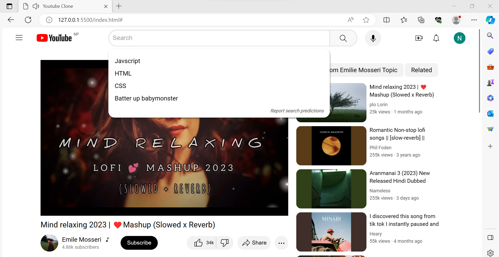
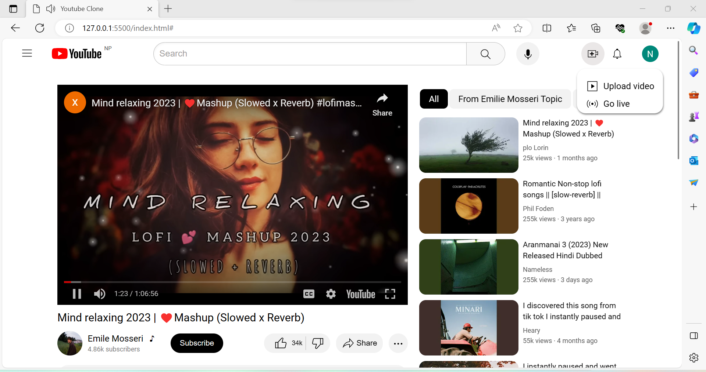

# Youtube-Clone

An exact replica of youtube using HTML, CSS and JS.

## Features

- Responsive
- UX elements like pointer on hover, clickable links, tooltips
- Interactive Search section with dropdown showing some hardcoded search recommendation
- Upload Modals and Notification Modals opens up whenever you click in respective section just like in youtube
- Video plays automatically on landing the page
- New video is played on clicking any of the videos from recommended section
- Tag based filter for recommended videos
- Can like and dislike the video
- Can share the video in social media and can copy the original youtube url of the video being played
- Comments section where you can add new comments and add replies as well
- Can sort the comments based on top comments and newest first

## Some Screenshots

